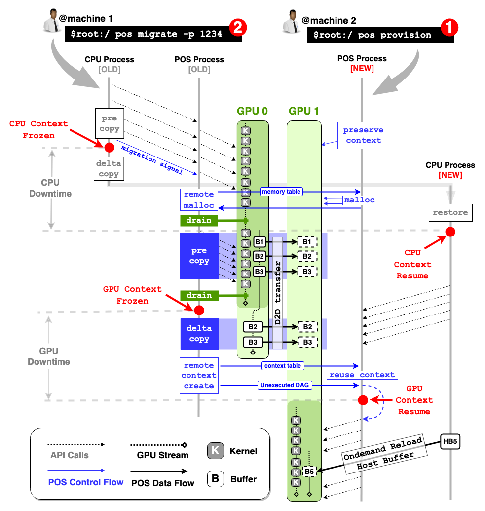

# PhoenixOS
[](https://phoenixos.readthedocs.io/en/latest/cuda_gsg/index.html#)
[](https://phoenixos.readthedocs.io/en/latest/rocm_gsg/index.html)
[]()
[](https://join.slack.com/t/phoenixoshq/shared_invite/zt-2tkievevq-xaQ3sctxs7bLnTaYeMyBBg)
[](https://phoenixos.readthedocs.io/en/latest/)

<div align="center">
    
</div>

<div>
    <div style="padding: 0px 10px;">
        <p>
        <h3 style="margin:0px; margin-bottom:5px;">📑 Latest News</h3>
        <ul>
            <li style="margin:0px; margin-bottom:8px;">
                <p style="margin:0px; margin-bottom:1px;">
                    <b>[July.12, 2025]</b> Our paper is accepted at SOSP'25! 🎉 Please check our updated preprint at [<a href="https://arxiv.org/abs/2405.12079">Paper</a>]. We are still refactoring the code and will soon update the repo. Stay tuned :)
                </p>        
            <li style="margin:0px; margin-bottom:8px;">
                <p style="margin:0px; margin-bottom:1px;">
                    <b>[Nov.6, 2024]</b> PhOS is open sourced 🎉 [<a href="https://github.com/PhoenixOS-IPADS/PhoenixOS">Repo</a>] [<a href="https://phoenixos.readthedocs.io/en/latest/index.html">Documentations</a>]
                </p>
                <p style="margin:0px; margin-bottom:1px;">
                    👉 PhOS is currently fully supporting single-GPU checkpoint and restore
                </p>
                <p style="margin:0px; margin-bottom:1px;">
                    👉 We will soon release codes for cross-node live migration and multi-GPU support :)
                </p>                
            </li>
            <li>
                <p style="margin:0px; margin-bottom:5px;">
                    <b>[May 20, 2024]</b> PhOS paper is now released on arXiv [<a href="https://arxiv.org/abs/2405.12079">Paper</a>]
                </p>       
            </li>
        </ul>
    </div>
</div>    

<div>
    <p>
    <b>PhoenixOS</b> (PhOS) is an OS-level GPU checkpoint/restore (C/R) system. It can <b>transparently</b> C/R processes that use the GPU, without requiring any cooperation from the application (though with cooperation it would be faster :)).
    Most importantly, PhOS is the first (and only) OS-level GPU C/R system that can <b>concurrently execute C/R without stopping the execution of applications</b>.
    <p>
    Concurrent execution brings huge performance gains, e.g., please check below when compared with NVIDIA's CUDA-Checkpoint <a href="https://github.com/NVIDIA/cuda-checkpoint">nvidia/cuda-checkpoint</a>:
    <table>
        <tr><th align="center">Checkpointing Llama2-13b-chat</th></tr>
        <tr><td align="center"></td></tr>
    </table>
    <table>
        <tr><th align="center">Restoring Llama2-13b-chat</th></tr>
        <tr><td align="center"></td></tr>
    </table>
    <p>
    Note that PhOS is aiming to be a generic design towards various hardware platforms from different vendors, by providing a set of interfaces which should be implemented by specific hardware platforms. We currently provide the C/R implementation on CUDA platform, and we are planning to support ROCm and Ascend. Yet we hope we could get help from the community because getting the whole C/R done is really non-trivial.
    <table style="margin:20px 0px;">
        <tr><td><b>
        PhOS is currently under heavy development. If you're interested in contributing to this project, please join our <a href="https://join.slack.com/t/phoenixoshq/shared_invite/zt-2tkievevq-xaQ3sctxs7bLnTaYeMyBBg">slack workspace</a> for more upcoming cool features on PhOS.
        </b></td></tr>
    </table>
</div>

<br />

## I. Quick build 

Currently, we don't have pre-built binaries. 
Please check [build from Source](docs/docs/getting_started/build_from_source.md) for how to build and run from source! 

## II. Usage

Once successfully installed PhOS, you can now try run your program with PhOS support!

<table style="margin:20px 0px;">
    <tr><td><b>
    For more details, you can refer to <a href="https://github.com/SJTU-IPADS/PhoenixOS/tree/main/examples"><code>examples</code></a> for step-by-step tutorials to run PhOS.
    </b></td></tr>
</table>

### (1) Start `phosd` and your program

1. Start the PhOS daemon (`phosd`), which takes over all GPU reousces on the node:

    ```bash
    ## If built in an interactive container (or host)
    pos_cli --start --target daemon
    ```

    or 

    ```bash
    ## If built with our container
    make server-run
    ```

2. To run your program with PhOS support, one need to put a `yaml` configure file under the directory which your program would regard as `$PWD`.
This file contains all necessary informations for PhOS to hijack your program. An example file looks like:

    ```yaml
    # [Field]   name of the job
    # [Note]    job with same name would share some resources in posd, e.g., CUModule, etc.
    job_name: "llama2-13b-chat-hf"

    # [Field]   remote address of posd, default is local
    daemon_addr: "127.0.0.1"
    ```

3. You are going for launch now! Try run your program with `env $phos` prefix, for example:

    ```bash
    env $phos python3 train.py
    ```

### (2) Pre-dump your program

To pre-dump your program, which save the CPU & GPU state without stopping your execution, simple run:

```bash
# create directory to store checkpoing files
mkdir /root/ckpt

# pre-dump command
pos_cli --pre-dump --dir /root/ckpt --pid [your program's pid]
```

### (3) Dump your program

To dump your program, which save the CPU & GPU state and stop your execution, simple run:

```bash
# create directory to store checkpoing files
mkdir /root/ckpt

# pre-dump command
pos_cli --dump --dir /root/ckpt --pid [your program's pid]
```


### (4) Restore your program

To restore your program, simply run:

```bash
# restore command
pos_cli --restore --dir /root/ckpt
```


<br />

## III. How PhOS Works?

<div align="center">
    
</div>

For more details, please check our [paper](https://arxiv.org/abs/2405.12079).


<br />

## IV. Paper

If you use PhOS in your research, please cite our paper:

```bibtex
@inproceedings{phoenixos,
  title={PhoenixOS: Concurrent OS-level GPU Checkpoint and Restore with Validated Speculation},
  author={Xingda Wei, Zhuobin Huang, Tianle Sun, Yingyi Hao, Rong Chen, Mingcong Han, Jinyu Gu and Haibo Chen}
  booktitle={Proceedings of the ACM SIGOPS 31th Symposium on Operating Systems Principles},
  year={2025}
}
```


<br />

## V. Contributors

Please check <a href="https://github.com/SJTU-IPADS/PhoenixOS/blob/main/.mailmap">mailmap</a> for all contributors.
